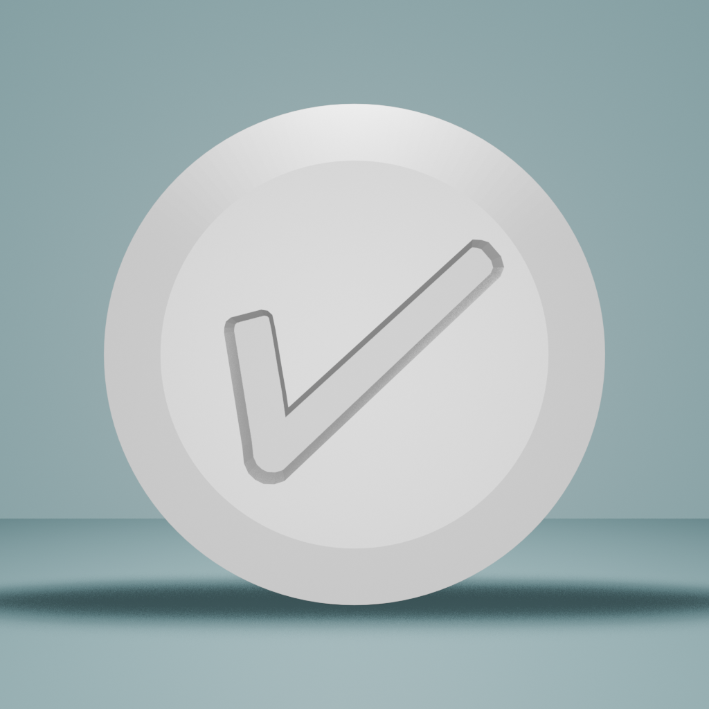

<div style="display:flex; justify-content: center; padding: 40px;">

</div>

# Therapy Track – simple pills tracker and reminder

## Running the development build

- Install the dependencies:

  ```sh
  npm install
  ```

- Start the development server:

  ```sh
  npm start
  ```

- Build and run iOS and Android development builds:

  ```sh
  npm run ios
  # or
  npm run android
  ```

## Release build for android

### Install with adb

```sh
npx expo run:android --variant release
```

### Build apk file

- Prebuild the app

```sh
npx expo prebuild
```

- Build apk

```sh
cd android
./gradlew assembleRelease
```
