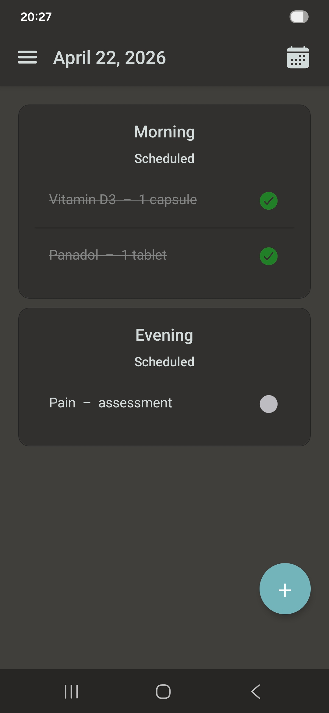
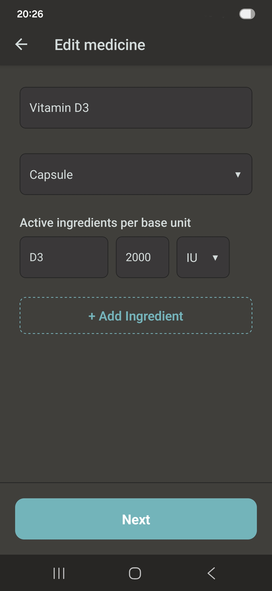
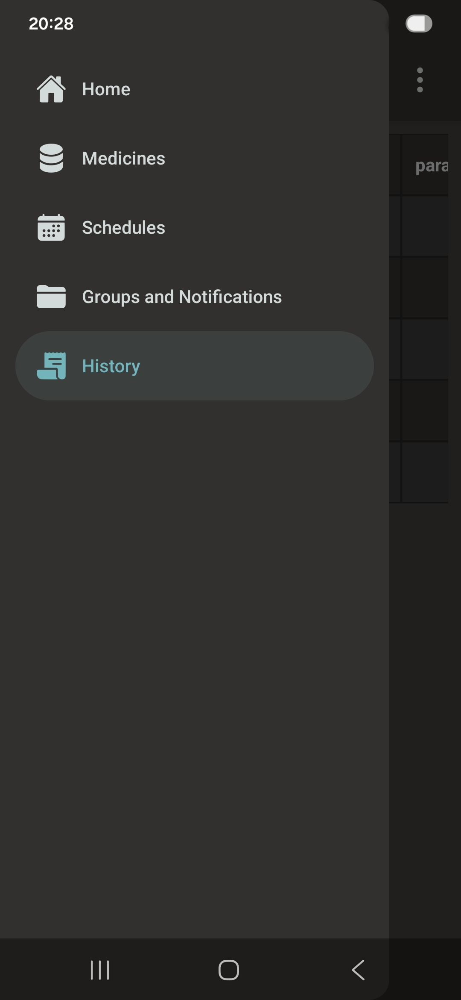

<p align="center">

</p>

# Therapy Track – medicine and assessments tracker

* Track your medication use with recurring schedules and one-time entries.
* Receive notifications when it is time to take your medication or complete an assessment.
* View your usage history and export it to a CSV file.


<p align="center">



</p>

# Installation on Android

The following instructions require only adb (from Android platfrom-tools) and docker installed. The building processs takes place inside of a docker container. The instructions assume physical Android device, although it will work similar for an emulator.

> [!TIP]
> The commands below have shortcuts in Makefile.

## Development set-up

This setup requires constant connection with the host and allows hot reloading of javascript code.

> [!TIP]
>  Once the app is installed steps 1 and 2 can be omitted for future connections.
>  It will require reinstall after changes in native code or dependencies.

1. Build a debug APK.
  ```sh
  docker compose run --rm expo bash -c "npx expo prebuild --platform android && cd android && ./gradlew assembleDebug"
  ```

2. Connect your device and install the development application

  ```sh
  adb install android/app/build/outputs/apk/debug/app-debug.apk
  ```

3. Start the development server:

  ```sh
  docker compose up expo
  ```

4. Enable port forwarding

  ```sh
  adb reverse tcp:8081 tcp:8081
  ```

5. Open the application on the Android device. Now whenever you make code changes the application should reload.


## Release build

1. Build a release APK.
  ```sh
	docker compose run --rm expo bash -c "npx expo prebuild --platform android && cd android && ./gradlew assembleRelease"
  ```

2. Connect your device and install the release application.

  ```sh
  adb install android/app/build/outputs/apk/release/app-release.apk
  ```
